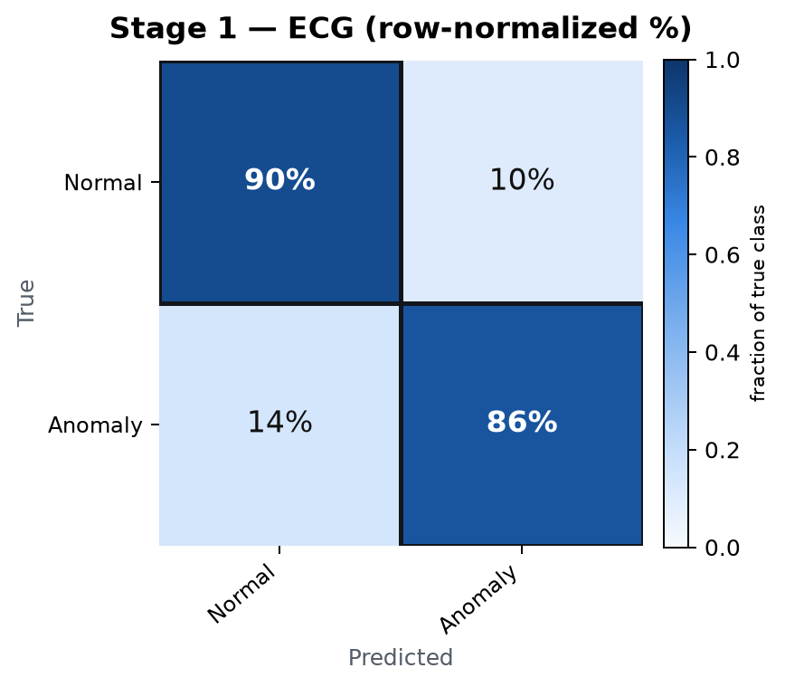
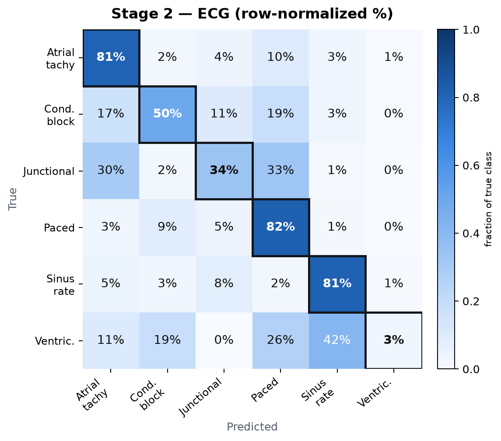

# ECG-Only Cascade — Performance Report

Single-lead ECG, evaluated end to end: Stage 1 flags anomalies, Stage 2 names the rhythm. All figures below are from the patient-disjoint held-out test fold (fold 9 of MIMIC-III-Ext-PPG) — none of these segments were seen during training.

| Dataset | Channel | Segment | Test fold | Stage 1 model | Stage 2 model |
|---|---|---|---|---|---|
| MIMIC-III-Ext-PPG | ECG · Lead II | 3,750 samples · 30 s @ 125 Hz | Fold 9 (patient-disjoint) | ResNet1D · 8.7M params | CNN + Transformer · 624K params |

---

## Stage 1 — Anomaly Detection

Normal sinus rhythm vs. any other rhythm — n = 579,006 test segments.

| ROC-AUC | PR-AUC | Accuracy |
|---|---|---|
| **0.940** | **0.907** | **89%** |

### Confusion matrix (row-normalized — each row sums to 100%)

**Per-class detail (counts)**

| Class | Precision | Recall | F1 | Support |
|---|---|---|---|---|
| Normal (SR) | 0.91 | 0.90 | 0.91 | 359,289 |
| Anomaly | 0.84 | 0.86 | 0.85 | 219,717 |
| *Weighted avg* | *0.89* | *0.89* | *0.89* | *579,006* |

---

## Stage 2 — Rhythm-Type Classification

Runs only on Stage-1 anomalies — n = 220,331 test segments, 6 rhythm groups.

| Accuracy | Macro F1 | Weighted F1 |
|---|---|---|
| **79%** | **0.49** | **0.82** |

### Confusion matrix (row-normalized — each row sums to 100%)

**Per-class detail (counts)**

| Class | Precision | Recall | F1 | Support |
|---|---|---|---|---|
| Atrial tachy | 0.77 | 0.81 | 0.79 | 42,691 |
| Conduction block | 0.50 | 0.50 | 0.50 | 15,007 |
| Junctional | 0.01 | 0.34 | 0.02 | 541 |
| Paced | 0.72 | 0.82 | 0.77 | 31,220 |
| Sinus rate | 0.98 | 0.81 | 0.89 | 130,764 |
| Ventricular | 0.00 | 0.03 | 0.00 | 108 |
| *Macro avg* | *0.50* | *0.55* | *0.49* | *220,331* |
| *Weighted avg* | *0.87* | *0.79* | *0.82* | *220,331* |

> **Flag — junctional over-predicted:** 8% of true sinus-rate segments and 33% of true paced segments are misread as junctional — that's what drags precision down to 0.01 despite 34% recall. Class-weighting pushed the model to guess this rare class too freely rather than learn it. Needs a gentler weighting scheme (capped weights or focal loss), not more data alone.
>
> **Flag — ventricular effectively unlearned:** 0% F1. Only 108 test examples (0.05% of Stage-2 test cases) — the rarest rhythm group by a wide margin. This reads as an insufficient-data problem rather than an architecture problem; consider merging it into a broader group or flagging predictions here as low-confidence rather than trusting the class outright.

---

*Held-out test fold, never seen in training or model selection. Generated from `src/evaluate.py`.*
