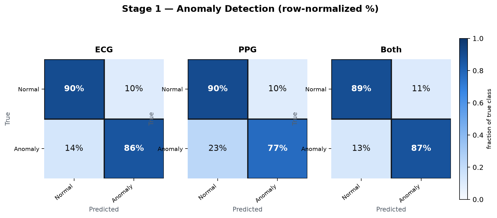
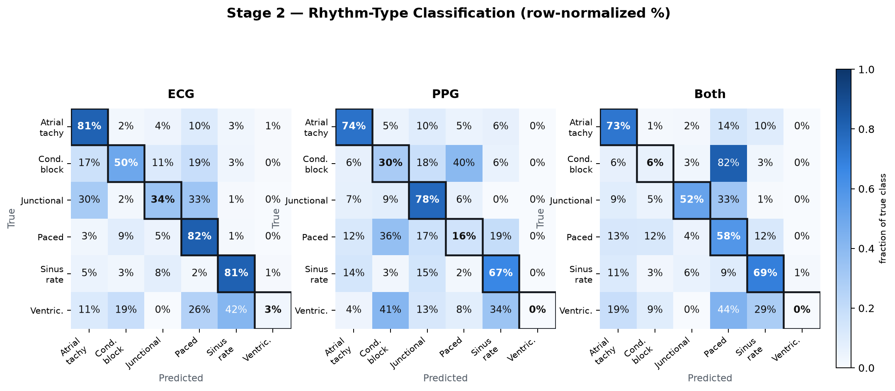

# ECG vs. PPG vs. Fusion — Cascade Performance Report

Same two-stage cascade, three sensor configurations, evaluated on the same patient-disjoint held-out test fold (fold 9 of the MIMIC-III-Ext-PPG dataset, never seen during training).

**Bottom line up front:** ECG-only wins on every metric in both stages. PPG-only is meaningfully weaker but still clears a usable bar for Stage 1 screening — worth keeping as a fallback for sensors that only have PPG (e.g. wrist-worn wearables). Fusion (ECG+PPG together) does not currently beat ECG-only in either stage.

| Dataset | Segment | Stage 1 model | Stage 2 model | Fusion strategy |
|---|---|---|---|---|
| MIMIC-III-Ext-PPG | 3,750 samples · 30 s @ 125 Hz | ResNet1D | CNN + Transformer | Late fusion, two encoders |

---

## Stage 1 — Anomaly Detection

Normal sinus rhythm vs. any other rhythm.

| Modality | ROC-AUC | Δ vs ECG | PR-AUC | Accuracy | n (test) |
|---|---|---|---|---|---|
| **ECG** | **0.940** | — | **0.907** | 89% | 579,006 |
| PPG | 0.908 | −0.032 | 0.881 | 85% | 588,450 |
| Both (fusion) | 0.938 | −0.002 | 0.899 | 88% | 579,006 |

### Confusion matrices (row-normalized — each row sums to 100%)

**Per-class detail (counts)**

| Modality | Class | Precision | Recall | F1 | Support |
|---|---|---|---|---|---|
| ECG | Normal (SR) | 0.91 | 0.90 | 0.91 | 359,289 |
| ECG | Anomaly | 0.84 | 0.86 | 0.85 | 219,717 |
| PPG | Normal (SR) | 0.86 | 0.90 | 0.88 | 361,831 |
| PPG | Anomaly | 0.83 | 0.77 | 0.80 | 226,619 |
| Both | Normal (SR) | 0.92 | 0.89 | 0.91 | 359,288 |
| Both | Anomaly | 0.83 | 0.87 | 0.85 | 219,718 |

> **Read:** PPG's normal-class recall (90%) is actually a hair above ECG's — the real cost is anomaly recall: PPG misses 23% of true anomalies vs. ECG's 14%. 77% anomaly recall from a wrist sensor alone is still a workable first-pass filter, not a coin flip.

---

## Stage 2 — Rhythm-Type Classification

Runs only on Stage-1 anomalies. Six rhythm groups (see `src/data/labels.py` for how raw rhythm codes were grouped).

| Modality | Macro F1 | Δ vs ECG | Weighted F1 | Accuracy | n (test) |
|---|---|---|---|---|---|
| **ECG** | **0.50** | — | **0.82** | 79% | 220,331 |
| PPG | 0.34 | −0.16 | 0.63 | 59% | 227,190 |
| Both (fusion) | 0.34 | −0.16 | 0.67 | 64% | 220,331 |

### Confusion matrices (row-normalized — each row sums to 100%)

**Per-class detail (counts) — ECG**

| Class | Precision | Recall | F1 | Support |
|---|---|---|---|---|
| Atrial tachy | 0.77 | 0.81 | 0.79 | 42,691 |
| Conduction block | 0.50 | 0.50 | 0.50 | 15,007 |
| Junctional | 0.01 | 0.34 | 0.02 | 541 |
| Paced | 0.72 | 0.82 | 0.77 | 31,220 |
| Sinus rate | 0.98 | 0.81 | 0.89 | 130,764 |
| Ventricular | 0.00 | 0.03 | 0.00 | 108 |
| *Macro avg* | *0.50* | *0.55* | *0.49* | *220,331* |
| *Weighted avg* | *0.87* | *0.79* | *0.82* | *220,331* |

> **Flag — junctional over-predicted:** on ECG, 8% of true sinus-rate segments get misread as junctional; on PPG alone it's 15%. Junctional's precision collapses to near-zero in all three modalities — a class-weighting artifact (the model over-guesses this rare class), not something a better sensor fixes on its own.
>
> **Flag — ventricular unlearned everywhere:** 0% F1 in all three modalities. Only 108–109 test examples — the rarest rhythm group by a wide margin. No sensor combination fixes an insufficient-data problem.

---

## Recommendation

1. **Deploy ECG-only as the primary path.** It leads on every metric in both stages — Stage 1 ROC-AUC 0.940 vs. 0.908 (PPG) / 0.938 (fusion); Stage 2 macro-F1 0.50 vs. 0.34 / 0.34.
2. **Keep PPG-only as a real fallback, not a downgrade in name only.** For Stage 1 screening, 0.908 ROC-AUC / 77% anomaly recall from a wrist-worn sensor alone is genuinely usable when no ECG lead is available. Treat its Stage 2 output (macro-F1 0.34) as lower-confidence — good for "something's off," not for naming the rhythm.
3. **Fusion isn't earning its complexity yet.** It never beats ECG-only and only marginally beats PPG-only, most likely because both encoders trained from scratch on the same fixed epoch budget as the single-modality runs. Revisit by warm-starting each branch from its single-modality checkpoint before writing fusion off.

---

*Held-out test fold, never seen in training or model selection. Generated from `src/evaluate.py`.*
